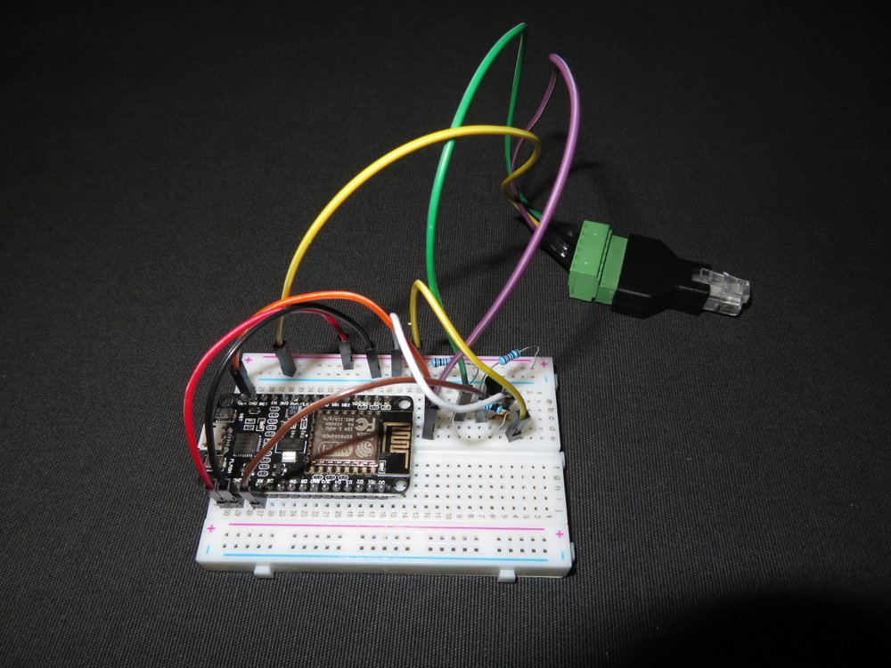

# P1-Energy-Meter-Reader
Reads values from the P1 port (Dutch/Belgian DSMR) of a digital energy meter (electricity/gas) with an esp8266 and posts to Thingspeak.

## Compatibility

Tested with a 3-phase [Sagemcom T211-D (Fluvius)](https://www.fluvius.be/nl/thema/meters-en-meterstanden/handleidingen-digitale-meter) (DSMR5) and an ESP8266 NodeMCU v2.
For some older meters the baud rate is 9600 instead of 115200. Other meters can also send other codes. Use `DEBUG_LEVEL 3` to see the output of your meter. 

## Features

- Reads data from the meter every `UPDATE_INTERVAL` ms (default: 60s).
- Sends electricity data every `SEND_INTERVAL` ms (default: 10s).
- Sends gas consumption data whenever there is an update from the meter.
- Stores the total energy consumption/injection values at midnight in order to report daily values. These values are stored in SPIFFS, so that they are remembered even if the esp8266 is turned off. In the Arduino interface flash size must include SPIFFS, e.g. 4M (1M SPIFFS).
- Runs a web server to present values in a web page.

## Electronic circuit

I [found](http://domoticx.com/p1-poort-slimme-meter-uitlezen-hardware/) the following circuit. The output on the right is to be connected to the RX port of the esp8266. 

Picture of the setup:

## Links

More [explanation](http://domoticx.com/p1-poort-slimme-meter-hardware/) (Dutch) on the P1 port for different digital meters.
